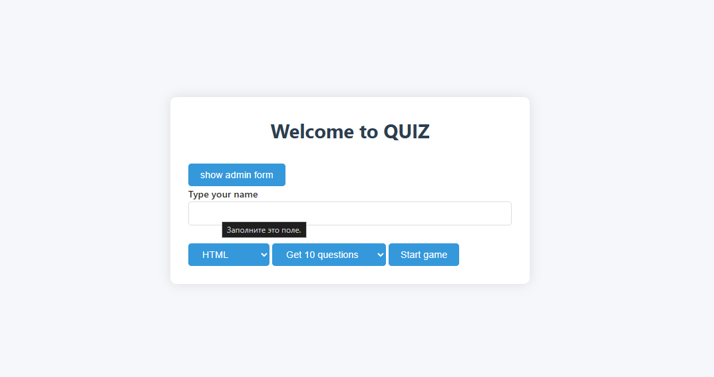

# JS Quiz

Викторина по вёрстке и JavaScript. Игрок вводит имя, выбирает тему и число
вопросов, после обратного отсчёта отвечает на них и получает результат с
процентом верных ответов. После каждого ответа показывается пояснение,
почему вариант верный.

**[Открыть демо →](https://alonaborealis.github.io/js-quiz/)**



## Стек

- JavaScript без библиотек и сборщиков
- `fetch` к собственному API, вопросы приходят с сервера, а не зашиты в код
- Элемент `<template>` для отрисовки вариантов ответа
- Экраны переключаются классами, переходы — на CSS
- Вёрстка на HTML5 и CSS

## Как устроено

Вопросы запрашиваются с
`js-quiz-questions-server.vercel.app/api/questions` с параметрами `theme` и
`limit`, так что набор вопросов задаётся при старте игры, а не хранится
в репозитории.

Отдельная форма позволяет добавлять и править вопросы прямо со страницы —
запросы `POST`, `PUT` и `PATCH` к тому же API.

Файл `questions.js` хранит резервный набор вопросов.

## Запуск

Страница обращается к внешнему API, поэтому её нужно открывать через сервер,
а не двойным кликом по файлу:

```
npx serve .
```
